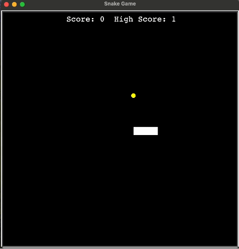

<div align="center"> Snake Game <br/> <br/>  </div>

# Snake Game in Python

## Overview

This is a simple implementation of the classic Snake Game using Python and Object-Oriented Programming (OOP) principles. The game is played in the console, and the snake grows longer as it consumes food, while the player aims to achieve the highest score without colliding with the game boundaries or the snake's own body.

## Features
- Object-oriented design for better code structure and readability.
- Simple console-based user interface.
- Snake grows in length upon consuming food.
- Score tracking to keep track of the player's progress.

## Requirements
Python 3.x

## How to Play
1. Clone the repository:

```
git clone https://github.com/sepidehkhakzad/SnakeGame.git
```

2. Navigate to the project directory:

```
cd SnakeGame
```

3. Run the game:

```
python main.py
```

4. Use the arrow keys to control the snake's direction:

- Up arrow: Move the snake up
- Down arrow: Move the snake down
- Left arrow: Move the snake left
- Right arrow: Move the snake right

5. Try to eat the food (denoted by F on the screen) to increase your score and the snake's length.

6. The game ends if the snake collides with the screen boundaries or its own body.

Here's a demo of the game:

<p align="center">
  
</p>

## File Structure
- main.py: Main Python script containing the game logic and implementation.
- snake.py: Snake object class to keep track of the length and movement of the snake.
- food.py: Food object class to keep track of the position of the food and change it after every collision.
- scoreboard.py: Scoreboard object class to keep track of the score and force the gameover sequence.
- README.md: Documentation file providing information about the project.

## Acknowledgments
This project was inspired by the classic Snake Game.
Special thanks to the Python community for providing valuable resources and support.

## Contribution
Contributions are welcome! Feel free to submit issues or pull requests to improve the game.

## License
This Snake Game project is licensed under the Apache License.

Enjoy the game! 🐍🎮

